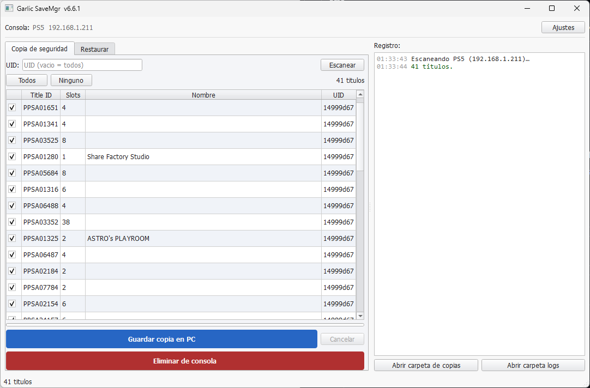
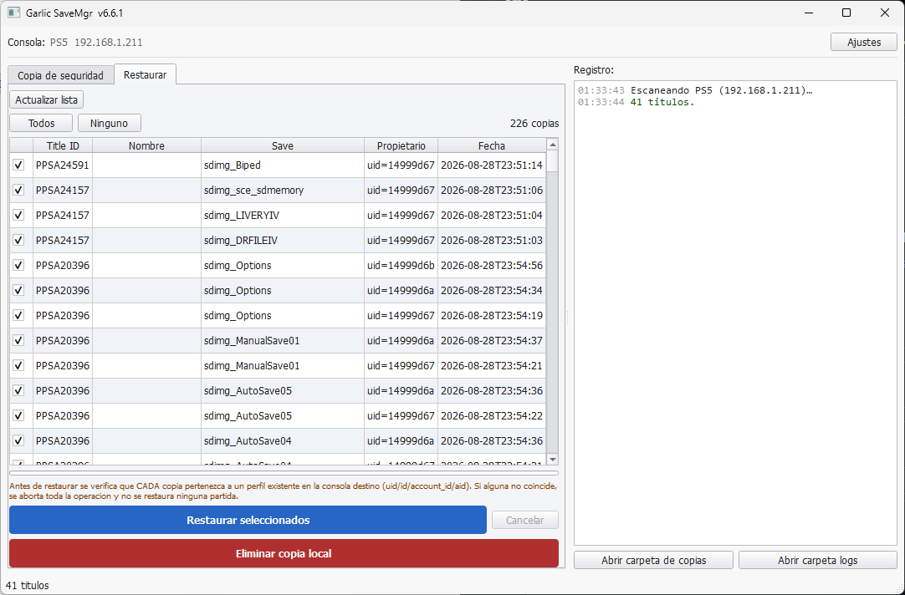
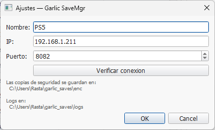
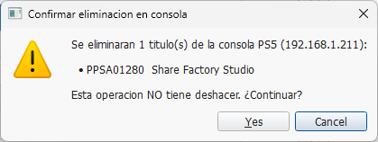

# Garlic SaveMgr

**Garlic SaveMgr** es un cliente de escritorio para Windows diseñado para realizar copias de seguridad y restaurar partidas guardadas de **PS5** mediante la red local.

El proyecto nació como una herramienta experimental de gestión de saves y ha evolucionado progresivamente hasta convertirse en un cliente centrado en una tarea concreta: **respaldar, conservar y restaurar partidas de forma controlada, evitando modificaciones innecesarias sobre los datos de la consola**.

> **Estado actual:** v6.6.1  
> **Plataforma:** Windows / PC  
> **Consola:** PS5  
> **Interfaz:** Python + PySide6  
> **Licencia:** GPL-3.0

[](https://github.com/RastaFairy/Garlic-SaveMgr/releases)
[](./LICENSE)
[](https://github.com/RastaFairy/Garlic-SaveMgr)

---

## Índice

- [Descripción](#descripción)
- [Características](#características)
- [Capturas](#capturas)
- [Modelo de seguridad](#modelo-de-seguridad)
- [Requisitos](#requisitos)
- [Instalación](#instalación)
- [Configuración inicial](#configuración-inicial)
- [Copia de seguridad](#copia-de-seguridad)
- [Restauración](#restauración)
- [Gestión y eliminación](#gestión-y-eliminación)
- [Logs y diagnóstico](#logs-y-diagnóstico)
- [Arquitectura](#arquitectura)
- [Compatibilidad y alcance](#compatibilidad-y-alcance)
- [Historial del proyecto](#historial-del-proyecto)
- [Licencia](#licencia)
- [Aviso](#aviso)

---

## Descripción

Garlic SaveMgr permite conectar un PC con una PS5 que tenga ejecutándose el payload `garlic-savemgr`, listar los títulos disponibles y realizar operaciones de copia y restauración desde una interfaz gráfica.

La aplicación utiliza la red local para comunicarse con el servicio disponible en la consola. El puerto utilizado por el payload es **8082**.

El objetivo actual del proyecto no es ofrecer una herramienta genérica de modificación o resignado de saves, sino proporcionar un flujo de trabajo sencillo y seguro para:

- realizar backups locales;
- conservar los datos asociados al backup;
- seleccionar qué partidas restaurar;
- validar el perfil antes de restaurar;
- eliminar datos cuando el usuario lo solicita expresamente;
- registrar eventos y errores para facilitar el diagnóstico.

---

## Características

### Backup PS5 → PC

- Escaneo de los saves disponibles en la consola.
- Filtrado por UID de usuario.
- Selección individual o masiva de títulos.
- Descarga de las partidas al ordenador.
- Conservación del save cifrado en su formato original.
- Generación de metadatos asociados a cada backup.
- Identificación visual del resultado de cada operación.

### Restore PC → PS5

- Detección de backups locales.
- Selección individual o múltiple.
- Validación del perfil asociado al backup antes de modificar la consola.
- Cancelación de la operación completa cuando la validación no es correcta.
- Restauración únicamente cuando el backup es compatible con un perfil existente en la consola de destino.

### Gestión de datos

- Eliminación de títulos desde la consola.
- Eliminación de backups locales.
- Confirmación explícita antes de operaciones destructivas.
- Procesamiento controlado de los datos para reducir el riesgo de inconsistencias.

### Configuración y conectividad

- Configuración del nombre de la consola.
- Configuración de dirección IP.
- Configuración del puerto del payload.
- Comprobación de conectividad desde la aplicación.

### Diagnóstico

- Registro de eventos y errores.
- Registro de fallos relacionados con perfiles.
- Acceso directo a la carpeta de logs desde la interfaz.
- Información suficiente para facilitar el análisis de problemas de red o de restauración.

---

## Capturas

### Copia de seguridad



### Restauración



### Configuración



### Eliminación y gestión de datos



---

## Modelo de seguridad

Una de las decisiones más importantes de las versiones actuales es que **Garlic SaveMgr no realiza resignado arbitrario de partidas**.

El flujo de restauración está diseñado alrededor de la validación del perfil asociado al backup.

De forma conceptual:

```text
Backup local
    │
    ├── UID
    ├── ID
    ├── account_id
    └── otros metadatos
          │
          ▼
    Perfil de la PS5
          │
          ├── Coincide
          │      │
          │      ▼
          │   Restauración
          │
          └── No coincide
                 │
                 ▼
           Operación abortada
```

La intención es evitar que una restauración continúe cuando el backup no corresponde al entorno de usuario esperado.

### Principio de fallo seguro

Cuando una selección contiene datos que no superan la validación necesaria, la operación se detiene antes de modificar la consola.

Esto es especialmente importante en operaciones por lotes: **una selección parcialmente válida no debe convertirse en una restauración parcialmente ejecutada de forma imprevisible**.

---

## Requisitos

### PC

- Windows.
- Python **3.10 o superior** si se ejecuta desde código fuente.
- Acceso a una red local compartida con la PS5.
- Dependencias de Python requeridas por la aplicación.

### PS5

La consola debe tener ejecutándose el payload correspondiente de `garlic-savemgr`.

El payload proporciona el servicio HTTP que permite a Garlic SaveMgr comunicarse con la consola.

Repositorio del payload original:

[earthonion/garlic-savemgr](https://github.com/earthonion/garlic-savemgr)

> Garlic SaveMgr y el payload son componentes relacionados, pero independientes: este repositorio contiene el cliente de escritorio para PC.

---

## Instalación

### Opción 1 — Ejecutar desde Python

Clona el repositorio y ejecuta la aplicación desde su archivo principal:

```powershell
python Garlic_SaveMgr_main.py
```

La aplicación incluye el arranque necesario para comprobar/cargar sus dependencias Python cuando corresponda.

### Opción 2 — Ejecutable para Windows

Para uso final, es recomendable utilizar un ejecutable publicado en la sección **Releases** cuando exista una build disponible.

[Ver Releases](https://github.com/RastaFairy/Garlic-SaveMgr/releases)

### Compilar manualmente

Los usuarios que quieran generar su propio ejecutable pueden utilizar PyInstaller:

```powershell
pip install pyinstaller
pyinstaller --onefile --windowed --hidden-import=PySide6 --hidden-import=requests --icon="garlicon.ico" --name="Garlic_SaveMgr" Garlic_SaveMgr_main.py
```

El resultado se generará dentro de la carpeta `dist/`.

---

## Configuración inicial

Antes de utilizar las operaciones de backup o restore:

1. Enciende la PS5.
2. Ejecuta el payload `garlic-savemgr`.
3. Localiza la dirección IP de la PS5.
4. Abre Garlic SaveMgr.
5. Accede a **Configuración**.
6. Introduce la IP de la consola.
7. Mantén el puerto en `8082`, salvo que tu configuración utilice otro valor.
8. Utiliza la opción de comprobación de conexión.
9. Guarda la configuración cuando la conexión sea correcta.

El PC y la PS5 deben poder comunicarse entre sí dentro de la red local.

---

## Copia de seguridad

El flujo recomendado es:

```text
PS5
 │
 │  Red local
 ▼
Garlic SaveMgr
 │
 ├── Escanear
 ├── Seleccionar títulos
 └── Crear backup
       │
       ▼
PC / garlic_saves/
```

Desde la pestaña de backup se puede:

- escanear los títulos disponibles;
- filtrar por UID;
- seleccionar todos;
- seleccionar ninguno;
- realizar backups múltiples;
- revisar visualmente el resultado de cada operación.

Los backups se almacenan localmente junto con sus metadatos asociados.

La estructura de almacenamiento utilizada por la aplicación contempla el directorio:

```text
~/garlic_saves/
```

y su contenido de backups correspondiente.

---

## Restauración

El proceso de restauración sigue el flujo:

```text
Backup local
      │
      ▼
Cargar lista de backups
      │
      ▼
Seleccionar partida(s)
      │
      ▼
Validar perfil
      │
 ┌────┴────┐
 │         │
 ▼         ▼
OK       ERROR
 │         │
 ▼         ▼
Restore   Abort
 │
 ▼
PS5
```

Antes de restaurar, la aplicación comprueba la información de perfil almacenada con el backup frente a la información disponible en la consola.

### Importante

**No se debe interpretar Garlic SaveMgr como una herramienta de resignado universal.**

Un backup perteneciente a otro perfil o incompatible con el perfil disponible en la consola puede ser rechazado deliberadamente.

Esta limitación es una decisión de diseño y seguridad, no un error de interfaz.

---

## Gestión y eliminación

Garlic SaveMgr también permite eliminar datos, tanto en el PC como en la consola.

### Eliminar desde la consola

La opción de eliminación de consola está destinada a borrar los datos de guardado del título seleccionado.

Por tratarse de una operación destructiva:

- requiere confirmación;
- debe utilizarse con precaución;
- no debe considerarse un mecanismo de recuperación.

### Eliminar backups locales

Los backups almacenados en el PC pueden eliminarse desde la pestaña correspondiente.

Esto elimina los archivos locales seleccionados y no modifica automáticamente los datos existentes en la consola.

---

## Logs y diagnóstico

La aplicación mantiene información de diagnóstico para facilitar el análisis de problemas.

Los registros pueden incluir:

- errores de conexión;
- errores de transferencia;
- problemas de validación;
- advertencias;
- operaciones realizadas;
- errores durante backup o restore.

La interfaz proporciona acceso a la carpeta de logs.

Cuando se reporte un problema, los logs relevantes pueden ser especialmente útiles para reproducir y diagnosticar el fallo.

---

## Arquitectura

Garlic SaveMgr debe entenderse como dos componentes coordinados:

```text
┌───────────────────────────────┐
│            PC                 │
│                               │
│  Garlic SaveMgr               │
│  ┌─────────────────────────┐  │
│  │ PySide6 GUI             │  │
│  ├─────────────────────────┤  │
│  │ Backup / Restore        │  │
│  ├─────────────────────────┤  │
│  │ Profile validation      │  │
│  ├─────────────────────────┤  │
│  │ Local metadata / logs   │  │
│  └─────────────────────────┘  │
└──────────────┬────────────────┘
               │
               │ HTTP / LAN
               │
               ▼
┌───────────────────────────────┐
│             PS5               │
│                               │
│      garlic-savemgr payload   │
│                               │
│      Save data operations     │
└───────────────────────────────┘
```

La interfaz gráfica está implementada con **PySide6**, mientras que la comunicación con el payload se realiza mediante la API de red disponible en la consola.

---

## Compatibilidad y alcance

### Actualmente

El proyecto está orientado a:

- **PS5**
- **Windows / PC**
- conexiones mediante red local;
- backup y restauración de partidas;
- gestión de backups locales;
- validación de perfiles;
- diagnóstico mediante logs.

### Fuera del alcance actual

El historial del proyecto contiene versiones experimentales y etapas que incluían capacidades que posteriormente fueron retiradas o rediseñadas.

Entre ellas se encuentran diferentes aproximaciones a:

- PS4;
- resignado de saves;
- gestión Fuente/Destino;
- transferencia entre perfiles;
- flujos de edición o transformación de partidas;
- arquitecturas anteriores de gestión de saves.

Estas funciones no deben considerarse parte de la interfaz actual simplemente porque aparezcan documentadas en versiones históricas.

Para conocer exactamente qué funciones existieron, cuándo aparecieron y por qué cambiaron, consulta el historial:

**[→ Changelog completo](./changelog.md)**

---

## Historial del proyecto

Garlic SaveMgr ha pasado por numerosas iteraciones antes de llegar a la arquitectura actual.

El desarrollo evolucionó desde herramientas iniciales de gestión y experimentación hasta una aplicación mucho más centrada en la integridad del backup y la restauración controlada.

El histórico incluye, entre otros cambios:

- evolución de la interfaz;
- diferentes modelos de gestión de consola;
- soporte experimental para distintas plataformas;
- cambios en el tratamiento de SFO;
- modificaciones del formato y metadatos de backup;
- incorporación y posterior retirada de resignado;
- mejoras de validación de perfiles;
- cambios en las operaciones destructivas;
- correcciones relacionadas con índices y PFS;
- simplificación progresiva de la arquitectura;
- transición hacia el modelo PS5-only.

### Documentación histórica

El detalle por versión, incluyendo funcionalidades introducidas, modificadas y retiradas, está documentado en:

**[CHANGELOG — historial completo del proyecto](./changelog.md)**

---

## Estructura del repositorio

La distribución pública está deliberadamente orientada a mantener el código actual separado del material histórico de desarrollo.

Una estructura recomendada para el proyecto es:

```text
Garlic-SaveMgr/
├── Garlic_SaveMgr_main.py
├── README.md
├── changelog.md
├── LICENSE
├── garlicon.ico
├── garlicon.jpg
├── config.png
├── delete.png
├── main_backup.png
└── restore.png
```

Los experimentos y snapshots históricos del desarrollo no necesitan formar parte de la distribución pública actual: el historial técnico queda documentado en `changelog.md` y el historial de Git.

---

## Versionado

La versión estable actual indicada por el proyecto es:

```text
v6.6.1
```

Las versiones publicadas deben consultarse desde GitHub Releases:

[Releases](https://github.com/RastaFairy/Garlic-SaveMgr/releases)

El changelog histórico mantiene además la evolución de versiones internas y etapas de desarrollo que no necesariamente se publicaron como releases independientes.

---

## Licencia

Garlic SaveMgr se distribuye bajo los términos de la **GNU General Public License v3.0**.

Consulta el archivo [LICENSE](./LICENSE) para conocer las condiciones completas.

---

## Aviso

Garlic SaveMgr se proporciona como software libre y para fines legítimos de gestión y respaldo de datos.

Las operaciones de escritura y eliminación sobre la consola pueden provocar pérdida de datos si se utilizan incorrectamente.

Se recomienda mantener siempre un backup funcional antes de realizar cualquier operación destructiva o experimental.

**No existe garantía de recuperación ante un uso incorrecto del software, un fallo de red, un fallo del payload o datos de partida incompatibles.**

---

## Enlaces

- [Repositorio](https://github.com/RastaFairy/Garlic-SaveMgr)
- [Releases](https://github.com/RastaFairy/Garlic-SaveMgr/releases)
- [Issues](https://github.com/RastaFairy/Garlic-SaveMgr/issues)
- [Changelog](./changelog.md)
- [Licencia GPL-3.0](./LICENSE)
- [Payload garlic-savemgr](https://github.com/earthonion/garlic-savemgr)
