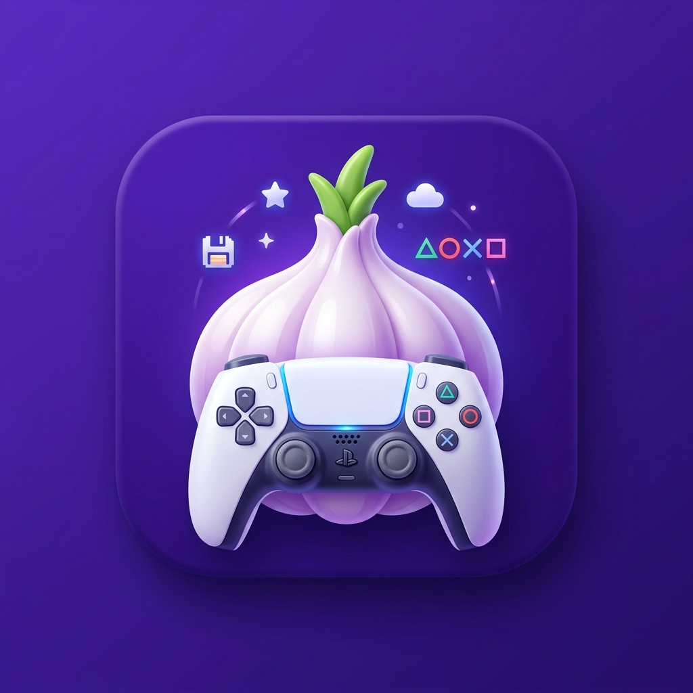

<p align="center">
  
</p>

# 🧄 Garlic SaveMgr v6.6.1 — Cliente PC

Cliente de escritorio desarrollado en Python con **PySide6** para la gestión de copias de seguridad (backup) y restauración de partidas guardadas (*saves*) exclusivamente para la consola **PS5**.

---

## 🚀 Requisito Obligatorio en la Consola

Para que esta aplicación pueda comunicarse con tu PS5, es **estrictamente necesario** que la consola tenga ejecutándose el **payload correspondiente (servidor de la API)**.

* **¿Qué hace este payload?** Abre el puerto `8082` en tu PS5 para permitir la transferencia de datos.
* **¿Cuándo activarlo?** Debes ejecutar el payload en tu consola **cada vez que enciendas la PS5**, antes de abrir este programa en el PC. Si la consola se apaga o se reinicia, la comunicación se cortará.

---

## 🛠️ Requisitos e Instalación en el PC

La aplicación requiere **Python 3.10 o superior** instalado en el sistema.

### Instalación automática (Bootstrap)
El script incluye un cargador automático. La primera vez que lo ejecutes, instalará de forma silenciosa las dependencias necesarias (`PySide6` y `requests`) si no se encuentran en tu sistema:
```bash
python garlic.py
```

### Compilación a Ejecutable (.exe) desde PowerShell
Si prefieres generar un archivo ejecutable único e independiente para Windows que oculte la consola de comandos trasera, ejecuta el siguiente comando en **PowerShell**:
```powershell
pip install pyinstaller
cd "Ruta/De/Tu/Carpeta"
pyinstaller --onefile --windowed --hidden-import=PySide6 --hidden-import=requests --icon="tu_icono.ico" --name="Garlic_SaveMgr" garlic.py
```

---

## 📖 Manual de Instrucciones (Guía de Uso)

### 1. Configuración de Red (Primer Uso)
1. Enciende tu PS5 y ejecuta el **payload**.
2. En el menú de tu consola, ve a *Ajustes > Red > Estado de la conexión > Ver estado de la conexión* y anota la **Dirección IP** (ej. `192.168.1.15`).
3. Abre Garlic SaveMgr en el PC. Si es la primera vez, se abrirá la ventana de **Ajustes** de forma automática (también puedes acceder mediante el botón *Ajustes* arriba a la derecha).
4. Introduce el nombre de la consola, la IP anotada y mantén el puerto en `8082`.
5. Haz clic en **Verificar conexion**. Si responde correctamente, pulsa **Ok** para guardar.

### 2. Copia de Seguridad (Consola ➡️ PC)
1. Entra en la pestaña **Copia de seguridad**.
2. Haz clic en el botón **Escanear** en la esquina superior derecha para listar los juegos de la consola.
   * *Opcional:* Puedes rellenar el cuadro **UID** antes de escanear para filtrar y mostrar únicamente los juegos de un usuario específico.
3. Marca las casillas de los títulos que quieras respaldar (puedes usar los botones rápidos *Todos* o *Ninguno*).
4. Haz clic en el botón azul **Guardar copia en PC**.
5. Las partidas se descargarán en formato cifrado original dentro de tu directorio de usuario en `~/garlic_saves/enc` junto a un archivo `.json` de metadatos. El texto del título se iluminará en **verde** al completarse con éxito.

### 3. Restauración de Partidas (PC ➡️ Consola)
1. Accede a la pestaña **Restaurar**.
2. Haz clic en **Actualizar lista** para cargar los respaldos locales del ordenador.
3. Selecciona la partida que deseas devolver a la PS5.
4. Haz clic en el botón azul **Restaurar seleccionados**.

> ⚠️ **POLÍTICA DE SEGURIDAD CRUCIAL (Fallo Cerrado):** Esta aplicación **no realiza refirmado de partidas**. Una copia local solo se restaurará si su perfil de origen (`uid`, `id`, `account_id` o `aid`) coincide plenamente con un perfil activo existente en la consola de destino. Si alguna de las copias seleccionadas no coincide, **se abortará toda la operación de inmediato antes de realizar cualquier modificación en la consola** para evitar la corrupción de datos.

### 4. Gestión y Eliminación de Datos
* **Eliminar de consola:** En la pestaña *Copia de seguridad*, puedes seleccionar un título de la lista y pulsar **Eliminar de consola**. Esto eliminará permanentemente todas las ranuras de guardado de ese juego en la PS5 (procesando los índices de mayor a menor para evitar desplazamientos accidentales en la API). Requiere confirmación expresa.
* **Eliminar copia local:** En la pestaña *Restaurar*, puedes borrar los archivos `.img` y `.json` seleccionados de tu PC haciendo clic en **Eliminar copia local**.

---

## 🪵 Diagnóstico y Logs
Cualquier evento, error de coincidencia de perfiles o advertencia se guardará detalladamente en la carpeta de historiales técnicos. Puedes acceder a ella directamente usando el botón **Abrir carpeta logs** ubicado en la parte inferior derecha de la interfaz.
